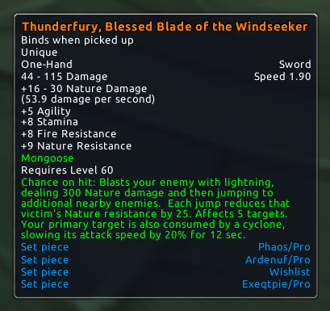
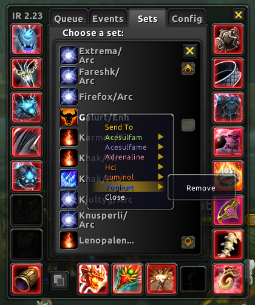
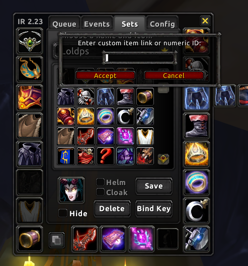
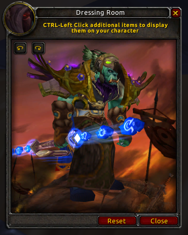

ItemRack
========

Fork of ItemRack ver. 2.23 addon. [Wow 2.4.3]

Improvements
------------

### Set Name in Tooltips

When hovering over an item, all user sets containing it will be listed in the
game tooltip. Think of it this way: define your wish list set and you'll see
this set's name when looting items from bosses!



### Inspect Saving & Send-To Alt

You can quickly save the item set of inspected character. Just use the
`/itemrack save` slash command while inspecting someone. The created
set will be named after the inspected character and talent spec.

It is also possible to send sets between characters. Any character you log will
appear in Set Send-To list. You can access it by **Right Clicking** any set in
the list in ItemRack options window. Select character name to send set, or
Remove to clear the alt.



> It is also possible to manipulate Send-To pool with slash commands:
> ```
> /itemrack push set_name     Moves the set from user set list to the pool.
> /itemrack pop set_name      Moves the set back from set pool.
> /itemrack pool              Lists all sets stored already in the pool.
> ```

### Easy Item Edit/Copy

While in set edit view, you can **Middle Click** the chosen slot to display
a prompt for numerical item ID to be set. You can also **Control+Middle Click**
to copy an item from any set; its ID will be automatically filled next time you
open the edit item window.



### Easy Try-On

You can easily preview how the set looks like in two ways:

- **Control+Left Click** a set in the set drop-down menu,
- with `/itemrack tryon set_name` slash command.


